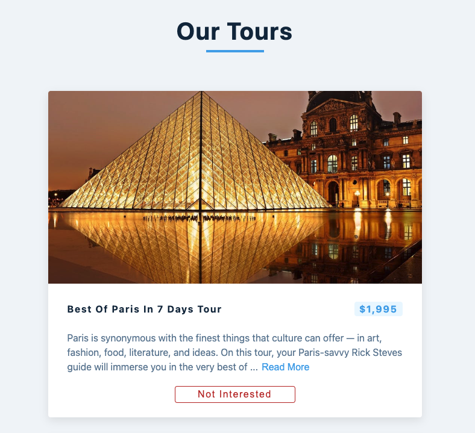
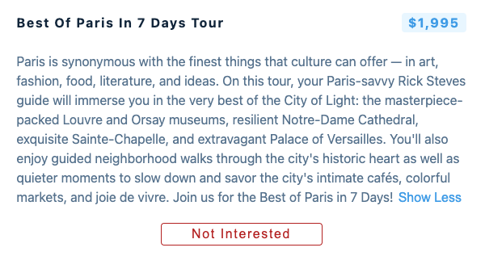
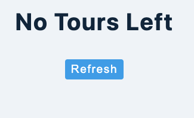

## Table of contents

- [Overview](#overview)
  - [Screenshot](#screenshot)
  - [Links](#links)
- [My process](#my-process)
  - [Built with](#built-with)
- [Author](#author)
- [Acknowledgments](#acknowledgments)

## Overview

A CRUD app made with create react app and react hooks

### Screenshot

### Links

- Live Site URL: [Deployed with netlify](https://fascinating-piroshki-40ca46.netlify.app/)

## My process

### Built with

- Semantic HTML5 markup
- CSS custom properties
- Flexbox
- [Create React App](https://create-react-app.dev/) - JS library

## Author

- LinkedIn - [Layne Taylor](https://www.linkedin.com/in/layne-taylor/)
- Twitter - [@laynerzzzz](https://www.twitter.com/laynerzzzz)

## Acknowledgments

This was part of a tutorial from John Smilga that I re-built from scratch for practice
